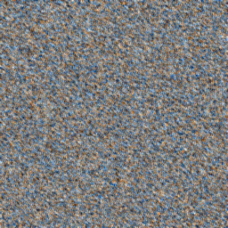

# nca - neural cellular automata  

normally noise:    


uniform noise:  
  

lower traingular kernel:  
  

random noise:  
  

## description
visualizing nca's in python/jupyter notebook:  
- 256, 256, 3 dim normally distributed tensors with value in range [0, 1] are used as the starting board / playground    
- kernel/convolutional filter of size 3, 3, 3 with values in range [0, 1]   
- activation function is defaulted to sigmoid but can be changed to anything i.e np.tanh ...   

random noise example:  
  

### usage
```bash
git clone "https://github.com/hashirkz/neural_cellular_automata" <directory to save to e.x /mnt/c/users/<urname>/documents>
code <directory u saved to>
pip3 install -r 'requirements.txt'

# 1. edit the kernel to your preference keeping its dimensions as 3, 3, 3
# 2. edit the starting playground or leave as random noise
# 3. run the notebook and view the gifs in ./gifs
```

#### issues
1. currently not sure why the imgs gradually lose color as they evolve/simulate could be activation function / hyperparameters
2. imageio.v3 is not working correctly *not my fault* the gifs produced flicker the first frame of the gif occasionally
